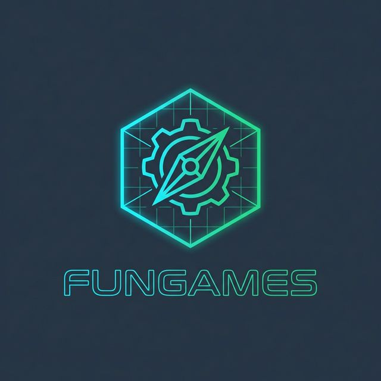

<p align="center">
  
</p>

# FunGames - Tactical Hub

FunGames is a premium suite of minimalist strategy and logic games designed for modern commanders. It combines high-intensity logic with a sleek, tactical aesthetic.

**Test Page**: [https://dsfungames.scifyclub.com/](https://dsfungames.scifyclub.com/)  
**Source Code**: [https://github.com/jodurpar/DsFunGames](https://github.com/jodurpar/DsFunGames)

## 🚀 Experience the Future of Strategy

Access curated tactical simulations featuring precision gameplay and immersive visual effects. 

### 🎮 Available Missions

*   **Tower Defense Lite**: Establish defensive perimeters and neutralize incoming opposition waves.
*   **Logic Robot**: Program tactical units using direction tokens to navigate complex urban grids.
*   **Grid Wars**: A chess-inspired tactical memory game to identify and secure hidden units.
*   **Hex Conquest**: Territorial capture simulation on a hexagonal grid against an adaptive AI.

## 🛠️ Tactical Features

*   **Multi-Language Support (i18n)**: Fully localized in English and Spanish with persistent user preferences.
*   **Adaptive UI**: Dynamic headers and footers that maximize gameplay area across all devices.
*   **Mobile Optimized**: Selective orientation locking for complex tactical environments.
*   **Interactive Simulation**: Realistic pathfinding, logical buffering, and real-time combat stats.

## 💻 Technical Infrastructure

Built with a state-of-the-art stack for maximum performance:

*   **Core**: React + TypeScript
*   **Styling**: Tailwind CSS for responsive tactical designs.
*   **Animations**: Motion (framer-motion) for fluid unit transitions.
*   **I18n**: i18next + react-i18next for global operation support.
*   **Testing**: Vitest + React Testing Library for component quality assurance.
*   **Deployment**: Fully containerized using Docker (Multi-stage build).

## 🏗️ Development

### Prerequisites
- Node.js (Latest LTS recommended)
- Docker Desktop (for containerization)

### Setup
```bash
# Install dependencies
npm install

# Start local tactical hub
npm run dev
```

### 🧪 Quality Assurance
```bash
# Run unit and integration tests
npm run test
```

### 🐳 Docker Deployment
```bash
# Build and deploy the production container (port 15260)
docker-compose up -d --build
```

## 📜 Documentation

For detailed technical specs and development history, refer to:
- `CHANGELOG.md`: Detailed mission logs and updates.
- `TechnicalConsiderations.md`: Core logic, architectural decisions, and containerization overview.

---
© 2026 DuranSoftware - Strategy Gaming Studio. All signals encrypted.
